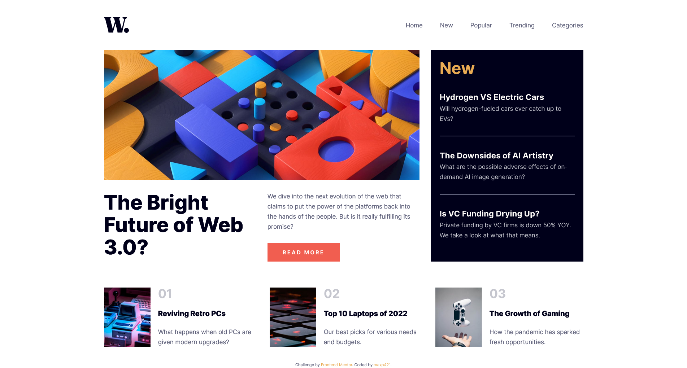

# Frontend Mentor - News homepage solution

This is a solution to the [News homepage challenge on Frontend Mentor](https://www.frontendmentor.io/challenges/news-homepage-H6SWTa1MFl). Frontend Mentor challenges help you improve your coding skills by building realistic projects. 

## Table of contents

- [Overview](#overview)
  - [The challenge](#the-challenge)
  - [Screenshot](#screenshot)
  - [Links](#links)
- [My process](#my-process)
  - [Built with](#built-with)
  - [What I learned](#what-i-learned)
  - [Continued development](#continued-development)
  - [Useful resources](#useful-resources)
- [Author](#author)
- [Acknowledgments](#acknowledgments)

## Overview

### The challenge

Users should be able to:

- View the optimal layout for the interface depending on their device's screen size
- See hover and focus states for all interactive elements on the page

### Screenshot



### Links

- Solution URL: [Add solution URL here](https://your-solution-url.com)
- Live Site URL: [Add live site URL here](https://github.com/maxp421/FM-news-homepage)

## My process

### Built with

- Semantic HTML5 markup
- CSS custom properties
- Flexbox
- CSS Grid
- Mobile-first workflow

**Note: These are just examples. Delete this note and replace the list above with your own choices**

### What I learned

I LEARNED

- About the `` attribute, and the `<picture>` tag. Using srcset with an image element is sufficient for serving different resolution size images. In cases where art direction (i.e. different/cropped/modified images for landscape/portrait orientation) has to be changed, the `<picture>` tag allows us to do that with different media conditions. The picture tag still needs an img tag within it to fall back on in case of compatibility issues while also providing alt="" text.

- More about proper accessibility guidelines, Using `<h1-h6>` tags to build a structured layout of headings and subheadings to make the page easier to navigate using screenreaders. I also learned that in cases where there isnt a heading provided its sometimes a good idea to create a visually hidden heading to keep a proper heading structure for screenreader users.

- How to use the `counter()` css function.

- If flex basis is equal to min width of flex items, the items will shrink
before they start wrapping.

- Links != buttons. Often times links like "Read More" are styled as buttons but their functionality is that of a link. To build links styled like buttons a good approach is to use `display: inline-block;`

- Using em units in some cases, like building buttons allows us to rescale the button including paddings just by changing the parent font size.

- To make an entire div with images/text clickable, the optimal approach is to add an anchor tag to the heading or another element, position the parent div as relative and add a pseudoelement off of the anchor tag that is full sized i.e. 
```css
.fp-articles-preview-text a::before {
  content: "";
  position: absolute;
  inset: 0;
}
```
### Continued development

Goals for my next Frontend Mentor projects are learning Sass, BEM, getting more experience with html5 and css overall and getting my toes wet with Javascript.

## Author
- Github - https://github.com/maxp421
- Frontend Mentor -https://www.frontendmentor.io/profile/maxp421